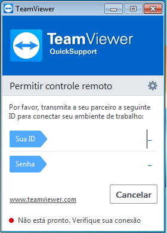

###### _TUTORIAL  (v1.0)_
# Atualize seu dispositivo - Acesso remoto 
**_O objetivo desse breve tutorial é auxiliar aos usuários do dispositivo FrescoGO na atualização do firmware do mesmo, utilizando suporte remoto._**

---------------------------------------------------------------------
``` 
Dúvidas quanto ao uso do TeamViewer:

1. O TeamViewer é uma ferramenta amplamente utilizada, no mundo inteiro, para o serviço de suporte remoto;
2. Não há como acessar sua máquina sem permissão;
3. Você verá tudo o que acontece, pois tudo se passa na tela, nada é feito sem que você tenha visualização, 
sendo assim bastaria fechar o programa.
```
**Dúvidas quanto ao uso do TeamViewer:**

*1. O TeamViewer é uma ferramenta amplamente utilizada, no mundo inteiro, para o serviço de suporte remoto;
*2. Não há como acessar sua máquina sem permissão;
*3. Você verá tudo o que acontece, pois tudo se passa na tela, nada é feito sem que você tenha visualização, 
sendo assim bastaria fechar o programa.

##### Video-aula: https://www.youtube.com/watch?v=u7jbKk6CK4I

---------------------------------------------------------------------
## *Pré-requisitos:*
-----------------------------------------------------------------------------
**1.** *TeamViewer Quick Support* instalado no computador;
    Baixe o aplicativo aqui: https://br.ccm.net/download/baixaki-13879-teamviewer-quicksupport?n=1#13879
    
**2.** Conexão com a internet.

## *Preparando o ambiente:*
-----------------------------------------------------------------------------
**Passo 1.** Execute o arquivo com um duplo-clique para abrir. Não é necessário ter privilégios de administrador do sistema;

**Passo 2.** Execute o arquivo com um duplo-clique para abrir. Não é necessário ter privilégios de administrador do sistema;

**Passo 3.** Abra o Bloco de Notas (será usado para conversa com o suporte);

**Passo 4.** Informe sua ID e senha para ser usado pelo suporte remoto;



**Passo 5.** Pronto, agora seu PC está pronto para ser acessado remotamente, conecte o seu dispositivo *FrescoGO* em uma porta USB e acompanhe a atuação do suporte que irá interagir com você através do Bloco de Notas;

Dúvidas quanto ao uso do TeamViewer:
1. O TeamViewer é uma ferramenta amplamente utilizada, no mundo inteiro, para o serviço de suporte remoto;
2. Não há como acessar sua máquina sem permissão;
3. Você verá tudo o que acontece, pois tudo se passa na tela, nada é feito sem que você tenha visualização, sendo assim bastaria fechar o programa.

Video-aula: https://www.youtube.com/watch?v=u7jbKk6CK4I


