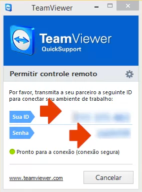

# Tutorial - Atualização por acesso remoto (Versão 1.0)
## Pré-requisitos:
-----------------------------------------------------------------------------
1. *TeamViewer Quick Support* instalado no computador;
    Baixe o aplicativo aqui: https://br.ccm.net/download/baixaki-13879-teamviewer-quicksupport?n=1#13879
2. Conexão com a internet.

## Preparando o ambiente:
-----------------------------------------------------------------------------
Passo 1. Execute o arquivo com um duplo-clique para abrir. Não é necessário ter privilégios de administrador do sistema;
Passo 2. Execute o arquivo com um duplo-clique para abrir. Não é necessário ter privilégios de administrador do sistema;

