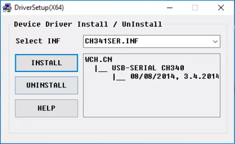
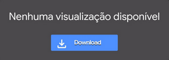
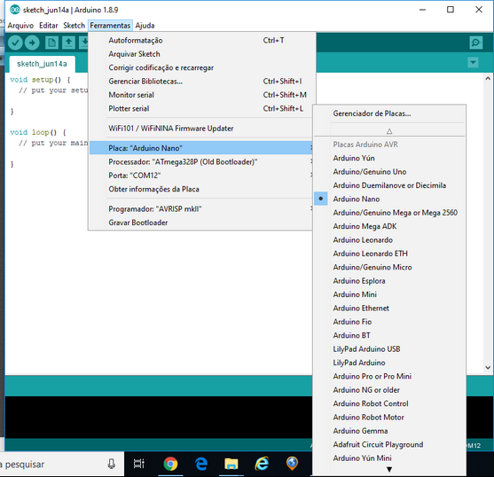
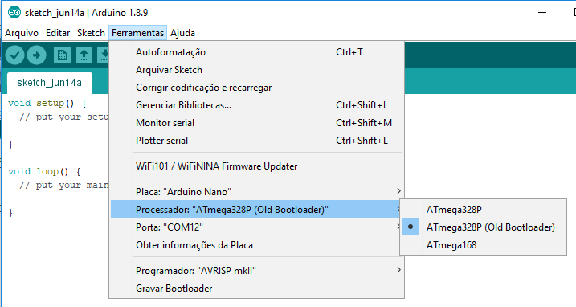
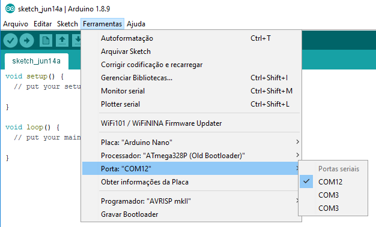
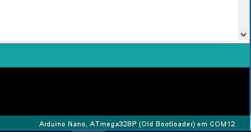

###### _TUTORIAL  (v1.0)_
# Atualize seu dispositivo - Faça você mesmo 
**_O objetivo desse breve tutorial é auxiliar aos usuários do dispositivo FrescoGO na atualização do firmware do mesmo._**

---------------------------------------------------------------------
**Se você não possui conhecimentos de instalação de aplicativos e drivers, bem como na configuração de hardware, sugiro que opte por realizar esta fase de _preparação do ambiente_ utilizando o [SUPORTE REMOTO](https://github.com/eltonrios/FrescoGO_Up/blob/master/tutoriais/atualizacao_remota.md)**

---------------------------------------------------------------------
**1.** Você vai precisar ter em mãos um computador e o dispositivo *FrescoGO* (com aquele cabo azul que acompanha o dispositivo);

**2.** Baixe o software IDE Arduino correspondente ao seu sistema operacional, clicando [aqui](https://www.arduino.cc/en/Main/Software) ;

**3.** Faça a instalação do mesmo;

**4.** Após a instalação, clique [aqui](https://drive.google.com/open?id=1VTL2lCYFa-qNSE-W7CuF0xUKozHJST1d) para baixar o driver para seu dispositivo;

=> Opção alternativa para esse driver pode ser encontrada [aqui](https://drive.google.com/open?id=1goUx56K8cNx4pufPFdrshv0VtVliTP9X);

**5.** Após baixar e clicar duas vezes irá abrir a janela abaixo:



**6.** Clique na opção Install;

<!-- Obs: http://blogdarobotica.com/instalando-driver-serial-para-arduinos-com-chip-ch340/
--> 

## *Efetuando atualização:*
---------------------------------------------------------------------
**1.** Crie em seu computador uma pasta denominada "**frescobol**" e baixe para a mesma os arquivos abaixo.
Clique em DOWNLOAD caso apareça a imagem abaixo;



Ou clique no símbolo de download, no canto à direita, ao alto;


* [frescobol.ino](https://drive.google.com/open?id=1nFQezbxYflJxR_rKfi_8pLKdJPdeRXDT)
* [serial.c.h](https://drive.google.com/open?id=1EdlmU6gT5JxPOP3KhOqpyzBlN9ryEByg)
* [pt.c.h](https://drive.google.com/open?id=1i8_rwovOJCyElaUpPtW1NmxSnorevre6)
* [tv.c.h](https://drive.google.com/open?id=1-9dPSNjR8qjJrg89yOwuOQyppwkKcDAK)
* [pitches.c.h](https://drive.google.com/open?id=1-0_HBmZCHC8zVWlNkYYWHzDSmayMDOke) 

_Obs: A versão aqui apresentada possui diferenças em relação à original no que diz respeito ao layout de tela porém os resultados são os mesmos. Clique [aqui](https://github.com/eltonrios/FrescoGO_Up/blob/master/README.md) para conhecer essa versão. Os links dos arquivos da versão original podem ser encontrados no final deste tutorial._ 
 
**2.** Entre na pasta criada acima e dê dois cliques no arquivo "**frescobol.ino**", isso fará com que seja aberto o **IDE Arduino** e todo o pacote carregado automaticamente;

**3.** Conecte seu dispositivo *FrescoGO* numa entrada USB do computador;

**4.** Vá no menu _Ferramentas_ e selecione a placa;



**5.** Selecione o processador;



**6.** Selecione a porta de comunicação (é provável que seja COM3 ou maior, já que COM1 e COM2 são normalmente reservados para portas seriais nativas, e não por USB);



**7.** Observe se irá conectar e reconhecer o dispositivo (no rodapé da janela do aplicativo, lado direito, deverá aparecer algo como "Arduino Nano, ATmega328P (Old Bootloader) em COM12" (a porta COM, principalmente, pode variar). Se isso acontecer já estará tudo pronto para proceder a atualização, sempre que necessário.;



**4.** Faça o envio da nova programação para seu dispositivo *FrescoGO*, clicando no icone de uma seta para a direita, que se encontra abaixo da opção "Arquivo", no menu principal;


**5.** Vai aparecer a palavra "Carregando..." na barra azul logo abaixo dos códigos, aguarde o processo ser concluído (normalmente dura de 15 a 30 segundos); 

**6.** Quando aparecer a palavra "Carregado." seu dispositivo já estará atualizado, podendo ser desconectado;

## *Dicas importantes:*
---------------------------------------------------------------------
**a.** Pode acontecer de, após uma atualização, virem valores estranhos nos parâmetros de configuração, observe e parametrize se necessário;

**b.** Em alguns casos pode ser necessário o *reset* (pressione os três botoões por cerca de 5 segundos).

**c.** Clique aqui para conhecer a versão 


## *Arquivos da versão original:*
---------------------------------------------------------------------
* [frescobol.ino](https://drive.google.com/open?id=1IfIijcZMfmG5VjZHAePnsniMEEECiUC2)
* [serial.c.h](https://drive.google.com/open?id=1vRsz_n9iXdh7xdED7TM6-yiZDOYG_6ln)
* [pt.c.h](https://drive.google.com/open?id=1YhX42NDzzATDHIvR7276KoYw6jTPIdkr)
* [tv.c.h](https://drive.google.com/open?id=1IOD05V6JS8LNATIkKeeQu03WjPRobs9h)
* [pitches.c.h](https://drive.google.com/open?id=1INsqrSP8M0tqQcELWQ9Lyw1x0xohcZas)

<!-- Formato de texto: https://guides.github.com/features/mastering-markdown/#examples

1. # GITHUB Github 
2. ## GITHUB Github
3. **GITHUB Github**
4. ###### GITHUB Github 
5. _GITHUB Github_
6. **_GITHUB Github_** 
7. *GITHUB Github* 
8. *_GITHUB Github_* 

# This is an <h1> tag
## This is an <h2> tag
###### This is an <h6> tag
 *This text will be italic*
_This will also be italic_

**This text will be bold**
__This will also be bold__

_You **can** combine them_
* Item 1
* Item 2
  * Item 2a
  * Item 2b
  1. Item 1
1. Item 2
1. Item 3
   1. Item 3a
   1. Item 3b
http://github.com - automatic!
[GitHub](http://github.com)
As Kanye West said:

> We're living the future so
> the present is our past.
I think you should use an
`<addr>` element here instead.

Task Lists
- [x] @mentions, #refs, [links](), **formatting**, and <del>tags</del> supported
- [x] list syntax required (any unordered or ordered list supported)
- [x] this is a complete item
- [ ] this is an incomplete item

```javascript
function fancyAlert(arg) {
  if(arg) {
    $.facebox({div:'#foo'})
  }
}
```

You can also simply indent your code by four spaces:

    function fancyAlert(arg) {
      if(arg) {
        $.facebox({div:'#foo'})
      }
    }
    
Here’s an example of Python code without syntax highlighting:

def foo():
    if not bar:
        return True
        
Tables
You can create tables by assembling a list of words and dividing them with hyphens - (for the first row), and then separating each column with a pipe |:

First Header | Second Header
------------ | -------------
Content from cell 1 | Content from cell 2
Content in the first column | Content in the second column

Any number that refers to an Issue or Pull Request will be automatically converted into a link.

#1
mojombo#1
mojombo/github-flavored-markdown#1

Strikethrough
Any word wrapped with two tildes (like ~~this~~) will appear crossed out.

Blockquotes
As Kanye West said:

> We're living the future so
> the present is our past.
Inline code
I think you should use an
`<addr>` element here instead.

-->
